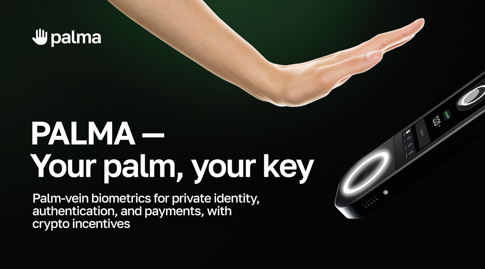

# 🌴 Palma Protocol  
### Your Palm. Your Key. Proof-of-Human for the Web3 AI Age.

---

## Abstract

**Palma Protocol** is a palm-based, privacy-preserving identity layer built on **Solana** — designed to prove real human presence, authenticate actions, and enable bot-resistant growth.  
Each user’s palm becomes a **cryptographic key**: surface lines for fast mobile onboarding, and subdermal vein scans for high-assurance verification.  

> “Trust should feel human, not bureaucratic.”

---

##  System Overview

Palm Scan → Feature Extraction → Encrypted Template → On-Chain Proof → Auth / Payment / Reward

- **Two-phase verification:**  
  1. Mobile palmprint capture for quick onboarding.  
  2. In-person palm-vein scan for full verification.  
- **Zero raw image storage:** only non-invertible templates.  
- **Open APIs:** developers can request proof-of-human, liveness, or palm-approved transaction consent.  

---

## 🧩 Core Components

| Component | Description |
|------------|--------------|
| **Palma App (Solana and other chains)** | Wallet + quest hub where users earn PALM tokens for verified actions. |
| **Portable Scanner** | Portable device for community operators to verify users offline around the world. |
| **Partner Hub** | Platform for running human-verified airdrops, quests, and loyalty programs. |
| **SDK / API** | Lets any dApp integrate palm authentication in minutes. |
| **Full scale POS terminal** | Payments with palm and business analytics for merchants  |

---

##  PALM Token

| Role | Purpose |
|------|----------|
| **Earn** | Rewards for completing quests, referrals, or operator verifications. |
| **Stake** | Required to run scanners or gain reward boosts. |
| **Spend** | Used for micro-fees, cashback, and partner incentives. |
| **Fairdrops** | Rewards for early supporters, adopters and community. |

**Token Supply:** 10 B PALM  
**Distribution:** 12% Airdrop, 12% Staking, 24% Cashback & Reserves, 19% Team, 10% Investors, 11% Liquidity, 12% Partnerships.

---

## 🚀 Vision

To make **proof-of-human** a universal primitive across Web3 —where every airdrop, vote, or payment can be verified as coming from a *real, consenting person*.

Palma = **privacy + presence + programmable trust**

---

## 📍 Roadmap (2025-2026)

| Phase | Goal |
|-------|------|
| Q4 2025 | Palma App Alpha → Beta (Earn/Quests v1) |
| Q1 2026 | Partner Hub + first verified quests |
| Q2 2026 | Portable Scanner closed beta |
| Q3 2026 | Operator Program launch |
| Q4 2026 | Merchant POS prototype & governance draft |

---

## 🧑‍🤝‍🧑 Team & Community

We’re builders from 🇰🇿 Kazakhstan working to bring human trust to Web3.  
Join our mission to make identity simple, private, and human again.

- Twitter: [@PalmaProtocol](https://twitter.com/palmaprotocol)  
- Docs: [whitepaper.pdf](./docs/Palma_Whitepaper.pdf)

---
📄 [Full Whitepaper (DOCX)](https://docs.google.com/document/d/1NMabarMmBVvq3iqSzwe8HLKdZfK2WlKU/edit?usp=sharing&ouid=103085383854947941682&rtpof=true&sd=true)

📘 [View PDF Version](https://drive.google.com/file/d/1-wuQEsOtKpr5Odj-_GEbYD2vn1waZLHY/view?usp=sharing)
### License

MIT License © 2025 Palma Protocol Team  
